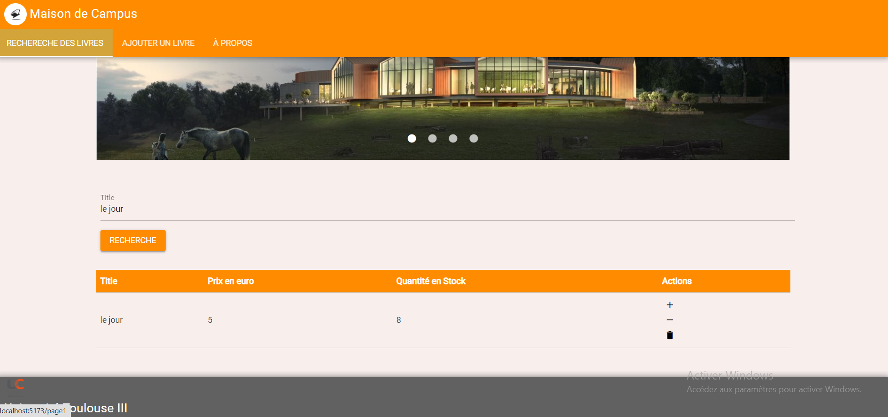

# lib-vue

Projet Bibiliothèque 
# pourquoi j'ai choisi le framework Quasar ? 

Les plugins Quasar offrent une solution complète et productive pour le développement d'applications Vue.js. Voici quelques-uns des avantages qu'ils offrent :

-Des interfaces utilisateur attrayantes et réactives, grâce à une conception soignée et à des composants visuellement agréables.
-Une intégration transparente avec Vue.js, permettant une utilisation facile et fluide des fonctionnalités du framework.
 # DEMO APP 
 * ajout Livre

Suppression avec un message de confirmation

Rechercher un livre



## Projet Setup

```sh
npm install
```

### Execution

```sh
npm run dev
```


